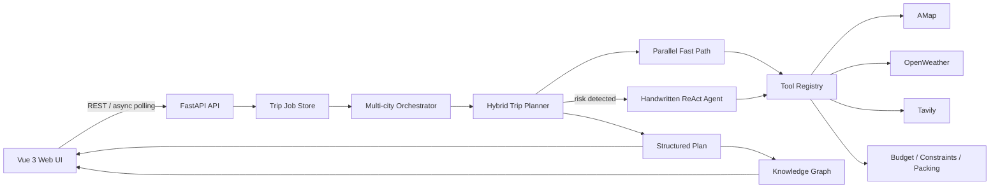

# TripWeave Agent

一个不依赖第三方 Agent 框架、基于 FastAPI 与 Vue 3 实现的智能旅行规划助手。

TripWeave Agent 将手写 ReAct Agent、工具注册、短期/长期记忆、真实地图 POI、天气、公开攻略检索、预算约束、多城市行程和知识图谱整合到一条可观察的异步规划链路中，适合学习 Agent 底层机制，也可作为旅行规划类全栈项目展示。

## 项目背景

多数 Agent 示例隐藏了工具 Schema、思考循环和状态管理细节。本项目从零实现这些核心能力，并针对旅行规划场景采用“快速确定性链路 + 异常时 ReAct 重规划”的混合策略：普通请求优先并发调用工具以降低延迟；预算超支、路线冲突或天气风险出现时，再让 LLM 进入深度重规划。

## 核心功能

- 手写 Agent Loop：解析 LLM 输出，执行工具并回填观察结果。
- Tool Binding：通过装饰器读取 Python 类型签名并生成 JSON Schema。
- 双层记忆：窗口式对话记忆与本地用户偏好记忆。
- 真实旅行数据：高德 POI/地理编码/路线、OpenWeather 预报、Tavily 公开攻略。
- 混合规划：快速链路、TTL 缓存、并行工具调用和 ReAct 异常重规划。
- 多城市规划：按城市和天数拆分规划，再合并日程、预算、天气和图谱。
- 约束求解：预算核算、每日时长、路线冲突和天气风险检测。
- 出行准备：行李清单和按日“洋葱穿衣法”建议。
- 可视化前端：异步进度、景点图文卡片、交互地图、预算、知识图谱、天气和 PDF 导出。
- 运行时设置：前端设置面板可保存本机 API 配置，接口不会回传密钥明文。

## 项目亮点

- **框架无关 Agent 内核**：Agent、Prompt、Memory、Tool Registry 和 LLM Client 均由项目自行实现。
- **低延迟混合编排**：正常场景走并发快速链路，仅在风险场景触发 ReAct。
- **多源真实性校验**：公开攻略用于发现候选，高德 POI 用于验证地点和补充地理信息。
- **结构化结果贯通前后端**：同一规划结果驱动日程、地图、预算、天气和知识图谱。
- **可发布安全设计**：密钥、本地设置、用户记忆和历史 Cookie 工具均不进入 Git。

## 技术难点

- 将函数类型注解稳定转换为 LLM 可调用的 JSON Schema。
- 在外部 API 延迟、限流和失败条件下维持可降级的规划流程。
- 合并多城市分段结果，并保持日期、预算和知识图谱关系一致。
- 在快速规则规划与 LLM 自主重规划之间建立明确的触发边界。

## 系统架构



更详细的设计见 [docs/architecture.md](docs/architecture.md)。

## 技术栈

| 层级 | 技术 |
| --- | --- |
| 前端 | Vue 3、TypeScript、Vite、ECharts、AMap JS API、jsPDF、html2canvas、Lucide |
| 后端 | Python 3.10+、FastAPI、Uvicorn、Pydantic |
| Agent | 手写 ReAct Loop、OpenAI-compatible Chat Completions、JSON Schema Tool Binding |
| 数据工具 | 高德 Web 服务、OpenWeather、Tavily |
| 存储 | 内存任务状态、JSON 本地用户偏好、TTL 内存缓存 |

## 目录结构

```text
tripweave-agent/
├─ backend/
│  ├─ app/
│  │  ├─ api/              # 路由、请求模型、异步任务状态
│  │  ├─ core/             # Agent、LLM、Prompt、Memory、Tool Registry
│  │  ├─ domain/           # 混合规划、多城市、结构化结果、知识图谱
│  │  └─ tools/            # 地图、天气、攻略、预算、约束、行李工具
│  ├─ data/                # 示例数据；真实用户状态被 Git 忽略
│  ├─ tests/               # 无外部 API 的核心单元测试
│  ├─ requirements.txt
│  └─ run.py
├─ frontend-vue/
│  ├─ src/
│  │  ├─ services/         # REST API 客户端
│  │  ├─ types/            # 前后端共享概念的 TS 类型
│  │  ├─ App.vue
│  │  └─ styles.css
│  ├─ package.json
│  └─ vite.config.ts
├─ docs/
├─ .github/
├─ .env.example
├─ .gitignore
├─ CONTRIBUTING.md
├─ CHANGELOG.md
└─ LICENSE
```


## 环境要求

- Python 3.10 或更高版本
- Node.js 20 LTS 或更高版本
- npm 10 或更高版本
- 可访问所配置第三方 API 的网络环境

## 安装与配置

```powershell
git clone <YOUR_REPOSITORY_URL>
cd tripweave-agent

Copy-Item .env.example .env
```

编辑根目录 `.env`，至少配置所需服务的密钥。普通完整链路建议配置：

```env
LLM_API_KEY=
LLM_BASE_URL=https://api.openai.com/v1
LLM_MODEL_ID=gpt-4o-mini
AMAP_WEB_SERVICE_KEY=
AMAP_WEB_JS_KEY=
OPENWEATHER_API_KEY=
TAVILY_API_KEY=
```

不要将真实 `.env`、Cookie 或 `backend/runtime_settings.json` 提交到仓库。

## 启动后端

```powershell
cd backend
python -m venv .venv
.\.venv\Scripts\Activate.ps1
python -m pip install -r requirements.txt
python run.py
```

默认地址：`http://127.0.0.1:8010`
健康检查：`http://127.0.0.1:8010/health`
OpenAPI 文档：`http://127.0.0.1:8010/docs`

## 启动前端

新开终端：

```powershell
cd frontend-vue
Copy-Item .env.example .env.local
npm ci
npm run dev
```

默认地址：`http://127.0.0.1:5190`

前后端地址或端口可通过 `.env` / `frontend-vue/.env.local` 修改，详见 [docs/deployment.md](docs/deployment.md)。

## 使用示例

1. 打开前端，输入目的地、日期、天数、人数、预算和偏好。
2. 多城市旅行可添加多个城市，并为每一站分配天数。
3. 点击生成规划，前端会轮询异步任务进度。
4. 在总览、地图、预算、图谱和原文标签之间查看结构化结果。
5. 可调整每日景点顺序、重新估算路线并导出 PDF。

直接调用 API：

```powershell
$body = @{
  city = "杭州"
  start_date = "2026-07-20"
  days = 2
  travelers = 2
  max_budget = 2500
  preferences = @("历史文化", "美食")
  pace = "moderate"
  accommodation = "standard hotel"
  transportation = "public transit"
  special_requirements = ""
  include_packing = $true
  cities = @()
} | ConvertTo-Json

Invoke-RestMethod -Method Post `
  -Uri http://127.0.0.1:8010/api/trip/plan/async `
  -ContentType application/json `
  -Body $body
```

接口清单与字段说明见 [docs/api.md](docs/api.md)。

## 测试与构建

```powershell
cd backend
python -m compileall app
python -m unittest discover -s tests -v

cd ..\frontend-vue
npm ci
npm run build
```

## 项目截图

截图目录已预留在 `docs/images/`。发布仓库前可加入总览、地图、每日行程和知识图谱页面截图，并在此处补充展示。

## 常见问题

**地图没有底图或无法交互**
确认 `AMAP_WEB_JS_KEY` 是 JS API Key，并检查高德控制台域名白名单；后端 POI/路线使用的是 `AMAP_WEB_SERVICE_KEY`，两者不能混用。

**天气某些日期没有数据**
OpenWeather 免费 5 天/3 小时接口只能覆盖近期预报窗口，超出窗口的日期会返回不可用状态。

**公开攻略为空**
检查 `TAVILY_API_KEY`、网络和额度。攻略检索失败不会自动伪造其他城市的数据。

**规划进入 ReAct 后变慢**
预算超支、路线冲突或天气风险会触发 LLM 深度重规划；可先提高预算、缩短每日景点数量或检查外部 API 延迟。

## 当前限制

- 异步任务保存在进程内存中，后端重启后任务状态会丢失。
- 用户偏好保存在单机 JSON 文件中，目前不适合多用户并发和生产环境。
- 尚未实现登录、权限、限流和服务端密钥加密存储。
- 预算来自规则估算，不代表实时票价、酒店价格或交通报价。
- 路线和 POI 质量取决于高德权限、配额与返回数据。
- OpenWeather 免费接口仅适合短期天气预报。
- 前端主页面仍集中在单个 `App.vue`，后续可继续组件化。

## 后续计划

- 使用 Redis 持久化任务进度与缓存。
- 引入数据库和用户体系，隔离个人记忆与配置。
- 增加可编辑预算单价、城市间交通和实时价格来源。
- 拆分前端页面组件并增加端到端测试。
- 增加 Docker 镜像、反向代理和生产部署示例。


## License

本项目使用 [MIT License](LICENSE)。
