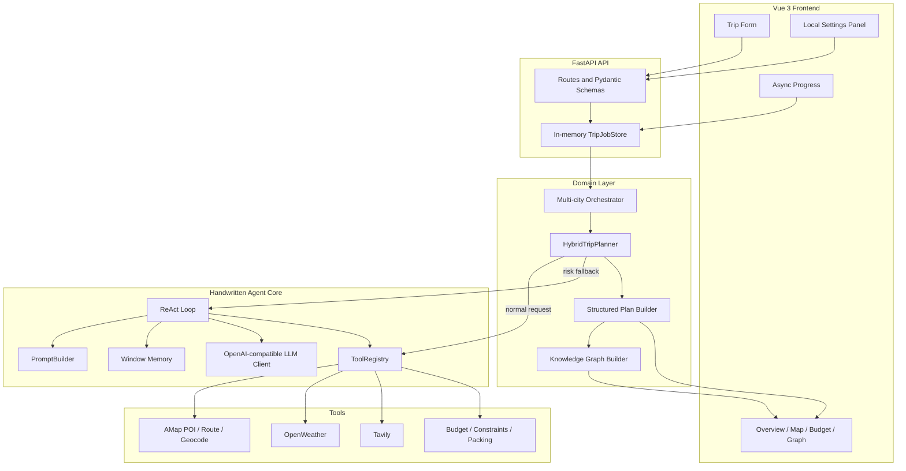

# 系统架构

## 设计目标

TripWeave Agent 的核心目标是展示一个不依赖 LangChain、LlamaIndex 等 Agent 框架的完整运行链路，同时让旅行规划在外部 API 较慢时仍具备可接受的响应速度。

## 分层结构

## Agent 核心

`backend/app/core/agent.py` 实现 ReAct 循环：

1. `PromptBuilder` 组合系统提示、工具 Schema、对话历史和任务状态。
2. `OpenAICompatibleLLM` 调用兼容 OpenAI Chat Completions 的服务。
3. `AgentOutputParser` 将模型文本解析为工具行动或最终答案。
4. `ToolRegistry` 校验工具名称并按函数签名分发参数。
5. 工具观察结果写入 `MemoryManager`，进入下一轮推理。

工具装饰器位于 `backend/app/core/tool.py`。它使用 `inspect.signature` 和类型注解生成 JSON Schema，不依赖第三方 Agent SDK。

## 混合规划策略

`HybridTripPlanner` 先执行快速链路：

- 查询景点 POI。
- 并行查询餐饮、住宿、天气和公开攻略。
- 将攻略候选重新交给高德验证。
- 构造每日 3 至 4 个景点的初始日程。
- 估算同日路线、预算和约束。
- 按需生成行李与穿搭建议。

当检测到预算超支、约束冲突或天气风险时，规划器调用 `TripPlanner` 进入 ReAct 深度重规划。若 LLM 不可用，系统保留快速链路结果并返回明确警告。

## 多城市合并

`backend/app/domain/multi_city.py` 根据每个城市的天数创建分段请求，依次执行城市规划，并合并：

- 日程日期与 Day 编号
- 景点、餐厅、酒店
- 天气数据
- 分类预算和总预算
- 原始 Agent 步骤
- 结构化结果与知识图谱

## 状态与存储

- 异步任务：`TripJobStore`，进程内存存储。
- 工具缓存：`TTLCache`，进程内存存储。
- 用户偏好：`backend/data/user_memory.json`，本机 JSON 文件。
- 运行时密钥：`backend/runtime_settings.json`，仅本机保存并被 Git 忽略。

当前存储方案适合本地学习和演示，不适合多实例生产部署。

## 前端数据流

前端通过 `POST /api/trip/plan/async` 创建任务，然后轮询 `GET /api/trip/jobs/{job_id}`。后端在每个工具步骤后更新进度、阶段和当前城市。任务完成后，前端直接使用 `structured_plan` 与 `knowledge_graph` 渲染所有视图。
